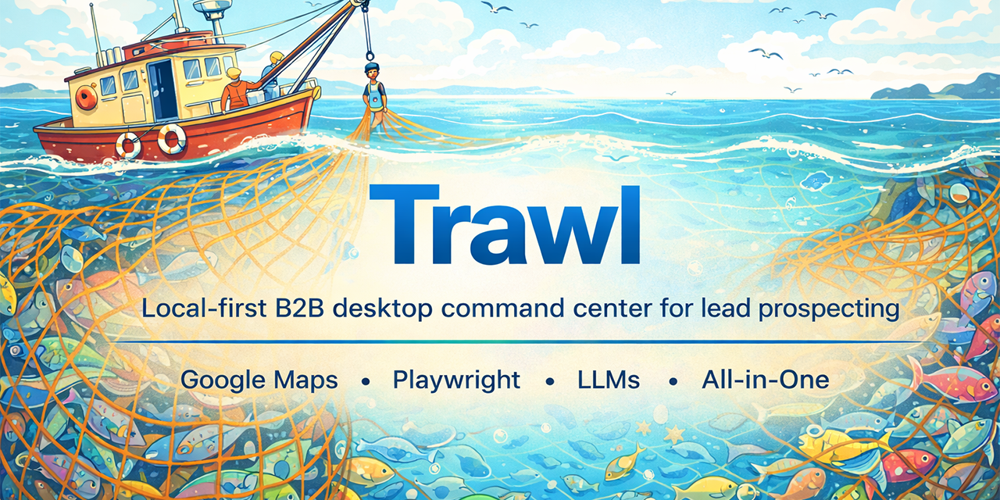

<p align="center">
  
</p>

<p align="center">
  <strong>Trawl is a local-first desktop app that finds real businesses, researches their websites with AI, scores the best-fit leads, and tees up outreach without turning your pipeline into SaaS sprawl.</strong>
</p>

<p align="center">
  
  
  
  
</p>

## The Pitch

Most outbound tools give you a list.

Trawl gives you a point of view.

It is a desktop command center for B2B prospecting: discover businesses in a target market, crawl their sites, extract useful intelligence, rank who actually fits, and generate personalized draft outreach from a single local app.

No hosted CRM maze. No browser-tab archaeology. No lead spreadsheet that dies the second it gets exported.

## Why It Hits

- Local-first by default. Your app, your database, your workflows, your machine.
- Distributed as a desktop app. Install it like a product, run it like an operator console.
- Research-backed prospecting. Trawl uses Playwright and LLMs to read the actual website, not just metadata.
- Built for action. Discovery, enrichment, scoring, and draft creation live in one pipeline.
- Human-close friendly. AI does the heavy prep; humans step in when judgment matters.

## Who This Is For

- B2B founders who want a private outbound machine instead of another SaaS seat
- Agencies and service businesses working narrow local markets
- Operators who want researched leads, not raw exports

### Core loop

1. Discover businesses by market and geography.
2. Enrich each lead with website content and business signals.
3. Score fit against your own company profile.
4. Queue personalized draft emails for review and sending.
5. Work the warmest leads instead of babysitting a list.

## Desktop Distribution

Trawl ships as an Electron desktop application with:

- A bundled Next.js UI
- A bundled Node runtime for packaged builds
- Local SQLite storage
- Bundled Playwright Chromium for web research tasks

Release artifacts are produced into `dist-electron/` when you run a desktop build, and the GitHub Actions workflow publishes installers on demand.

## Quick Start

### Run locally

```bash
pnpm install
pnpm desktop:install-playwright
pnpm desktop:dev
```

### Build desktop installers

```bash
pnpm desktop:dist
```

That build path packages the desktop app and writes distributables to `dist-electron/`.

## Stack

- Electron
- Next.js 15 App Router
- React 19
- Tailwind CSS
- SQLite via `node:sqlite`
- Playwright
- Vercel AI SDK

## Repo Notes

- Primary desktop entry: [`electron/main.cjs`](./electron/main.cjs)
- Desktop build scripts: [`scripts/desktop/dist.mjs`](./scripts/desktop/dist.mjs)
- Runtime bundling: [`scripts/desktop/prepare-node-runtime.mjs`](./scripts/desktop/prepare-node-runtime.mjs)

If outbound software should feel more like a mission-control app than a spreadsheet with a logo, that is the lane Trawl is trying to own.
